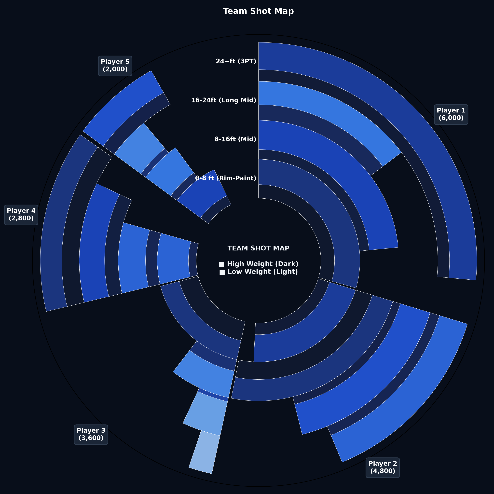
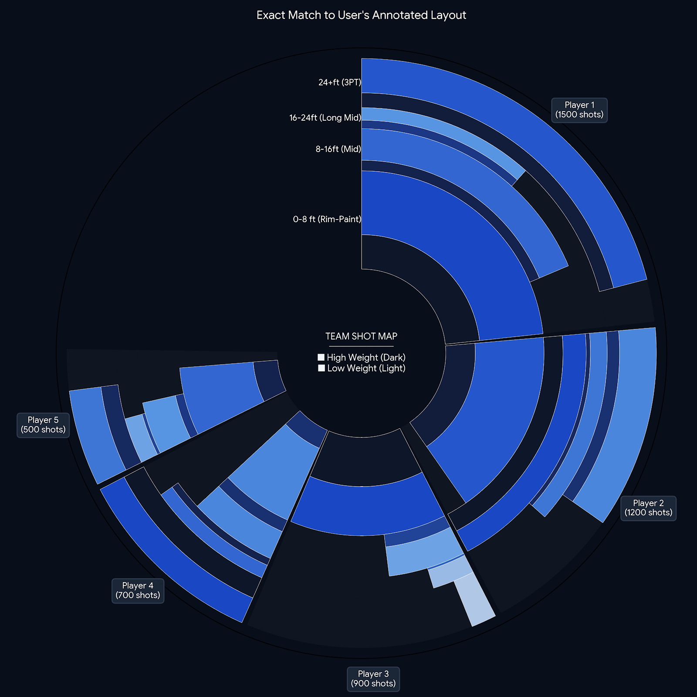

# 🌟 多层带权极坐标下沉图 (Multilayer Weighted Polar Chart)

[](https://www.python.org/downloads/)
[](https://opensource.org/licenses/MIT)

一个用于展示**高维数据关联性与粒度下沉（Association & Progressive Drill-down）**的极客风 Python 可视化工具组件。

传统柱状图或折线图在表达“宏观主体占比”、“中观维度下沉”和“微观质量/权重”时往往需要拆分多图。本项目通过极坐标下沉结构，在一张圆图内完美融合了**横向关联**与**纵向深度**。

本仓库同时收录基于该主题的 NBA 实战模板族 **「星环图 (Stellar-Ring Chart)」**（`team_shot_radial.py` + `star-templates/`），直连数据库生成可交互 SVG/HTML 投篮分布图。

---

## ✨ 核心特性 (Key Features)

- **横向关联性（Horizontal Association）**：最外圈基于总量自动计算弧长，首尾相连，直观展示各主体（如球员、部门、渠道）的全局份额。
- **纵向多层下沉（Multilayer Drill-down）**：由外向内逐层下沉至具体细分维度（如投篮距离、业务线、功能模块）。
- **动态权重色彩映射（Weight-based Color Mapping）**：
  - 扇形填充弧长代表完成度/覆盖率；
  - 色彩深度（深蓝 $\rightarrow$ 淡冰蓝）直接映射权重大小（如命中率、ROI、健康度），擅长/高权重项一眼可知。
- **无框垂直对齐图例（Clean Vertical Axis Legend）**：图示文字优雅对齐于 12 点钟垂直分割线左侧，告别笨重的图例方框，极具科技感。
- **可切换对齐方式（Left / Center）**：支持从扇区左侧填充（`"left"`），或沿扇区中心线对称展开为「翅膀」布局（`"center"`）。

---

## 📸 效果展示 (Preview)



---

## 🎯 参考布局 (Annotated Layout Reference)

以下为「Team Shot Map」主题的对齐示意图,可作为自定义样式与排版的参考:



---

## 🚀 快速上手 (Quick Start)

### 1. 安装依赖

```bash
pip install matplotlib numpy pandas
```

> 💡 绘图时传入 `align_mode='center'` 即可启用「对称翅膀」居中对齐；不传时默认 `"left"`。

---

## 🏀 星环图模板族 (Stellar-Ring Chart)

`team_shot_radial.py` 与 `star-templates/` 是本图表主题的**端到端真实应用**：直连 NBA 出手数据库，生成可交互的纯 SVG/HTML 投篮分布图（无需 matplotlib）。它与通用库 `multilayer_polar.py` 是同一「极坐标下沉图」主题的两条实现路线：

| 维度 | `multilayer_polar.py`（通用库） | 星环图家族（Stellar-Ring） |
| --- | --- | --- |
| 数据来源 | 传入 pandas `DataFrame` | 直连 PostgreSQL（`fct_pbp_shots`） |
| 渲染方式 | matplotlib → PNG | 纯 SVG → HTML（自带交互控件） |
| 对齐方式 | `left` / `center` 可选 | 全局动态角度比例（按出手量分配扇区） |
| 维度表达 | 权重着色 + 弧长 | 权重着色 + 弧长 + **clutch 关键时刻叠加** + **环上命中/出手数据标签** + **自适应背景层** |

### ✨ 2026-08-03 重设计要点

- **全局动态角度比例（GLOBAL DYNAMIC ANGLE RATIO）**：300° 数据弧按 Top-N 球员真实出手量严格比例分配，不再用固定 45° 槽位；
- **跨球员真实占比（CROSS-PLAYER FAITHFULNESS）**：同一距离环内，楔形弧长 = 其该带真实出手占比（同带内 peer-relative），跨球员可比；
- **30 队主题色（TEAM THEME COLORS）**：仅应用于 UI 外框（主/副色），4 态数据编码（命中/失手 × 常规/关键）保持恒定以保证跨队可比；
- **自适应背景层（ADAPTIVE BACKGROUND）**：通过 `--bg` 切换
  - `portrait`：球员灰度头像按扇区遮罩（默认）
  - `logo`：球队 logo 按扇区遮罩
  - `heatmap`：按区 FG% 热力色（蓝→黄→红）
  - `grid`：球队副色极简径向网格
- **5/6/7 人自适应布局**，顶部预留 60° 缺口放距离环标签。

### 🗂️ 四个变体 (`star-templates/`)

仓库内置 4 个开箱即用的背景变体模板，各自把 `--bg` 默认值写死，运行即生成同名 HTML：

| 模板 | 背景模式 | 预览 |
| --- | --- | --- |
| `star_grid.py` | `grid`（极简径向网格） | [star_grid_preview.html](star-templates/star_grid_preview.html) |
| `star_heatmap.py` | `heatmap`（FG% 热力） | [star_heatmap_preview.html](star-templates/star_heatmap_preview.html) |
| `star_logo.py` | `logo`（球队 logo 遮罩） | [star_logo_preview.html](star-templates/star_logo_preview.html) |
| `star_portrait.py` | `portrait`（球员灰度头像） | [star_portrait_preview.html](star-templates/star_portrait_preview.html) |

> 注：预览为静态 HTML 示例（已提交）。运行脚本默认输出 `<脚本名>.html`（如 `star_grid.html`），该生成物已在 `.gitignore` 忽略。

### 依赖与配置

```bash
pip install psycopg2-binary python-dotenv
```

在同目录创建 `.env`（**切勿提交**，已在 `.gitignore` 忽略）：

```dotenv
DB_HOST=localhost
DB_PORT=5433
DB_NAME=nba
DB_USER=postgres
DB_PASSWORD=your_password
```

数据表需含 `fct_pbp_shots(season, team, player_slug, shot_distance, is_make, is_clutch)`。
本地资源目录（头像/logo）见脚本内 `HEADSHOT_DIR` / `LOGO_DIR`。

### 用法

```bash
# CLI 入口 (team_shot_radial.py): <赛季> <球队三字码> <Top N> [bg] [输出路径]
python team_shot_radial.py 2025 BOS 5 portrait
# 等价于直接跑某一变体:
python star-templates/star_portrait.py 2025 BOS 5   # 默认 portrait 背景
python star-templates/star_grid.py 2025 OKC 7        # 默认 grid 背景, 支持 7 人
# 输出: 同名 .html (本地浏览器打开, 可切换赛季 / 球队 / 人数 / 背景)
```

---

## 📂 文件结构

```
multilayer-weighted-polar-chart/
├── multilayer_polar.py        # 通用库: plot_multilayer_polar_map (支持 align_mode='left'|'center')
├── example.py                 # 通用库使用示例
├── team_shot_radial.py        # 星环图 CLI 入口 (NBA 出手分布, DB 驱动, SVG/HTML)
├── star-templates/            # 星环图四个背景变体模板 (+ 各自 _preview.html 示例)
│   ├── star_grid.py           #   bg=grid     极简径向网格
│   ├── star_heatmap.py        #   bg=heatmap  FG% 热力
│   ├── star_logo.py           #   bg=logo     球队 logo 遮罩
│   └── star_portrait.py       #   bg=portrait 球员灰度头像 (默认)
├── README.md
├── LICENSE                    # MIT (Deo Cheng, 2026)
├── .gitignore
├── multilayer_polar_demo.png  # 通用库预览图
└── exact_user_layout.png      # 「Team Shot Map」参考布局图
```